# 4 Days

- ##### 优先级列表

  线程优先级表的数据类型为 rt_list，每个索引号对应线程的优先级，该索引下维护着一条双向链表，当线程就绪时，线程就会根据优先级插入到对应索引的链表，同一个优先级的线程都会被插入到同一条链表中，通过时间片的方式轮询。

  

- ##### rt_list_entry()

  rt_list_entry()是一个已知一个结构体里面的成员的地址，反推出该结构体的首地址的宏

  #define rt_list_entry(node, type, member) \ 
  		rt_container_of(node, type, member)

  其中node 表示一个节点的地址，type 表示该节点所在的结构体的类型，member 表示该节点在该结构体中的成员名称。

  #define rt_container_of(ptr, type, member) \ 
  		((type *)((char *)(ptr) - (unsigned long)(&((type *)0)->member)))

  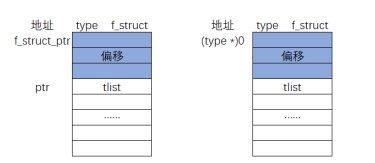

  我们知道了一个节点 tlist 的地址 ptr，现在要推算出该节点所在的 type 类型的结构体的起始地址	f_struct_ptr。我们可以将 ptr 的值减去图中灰色部分的偏移的大小就可以得到 f_struct_ptr 的地址，现在的关键是如何计算出灰色部分的偏移大小。这里取的做法是将 0 地址强制类型类型转换为 type，即(type *)0，然后通过指针访问结构体成员的方式获取到偏移的大小，即(&((type * )0)->member)，最后即可算出 f_struct_ptr = ptr -(&((type*)0)->member)。

- ##### 驱动开发

  - PIN

    相关接口如下

    | **函数**            | **描述**             |
    | ------------------- | -------------------- |
    | rt_pin_get()        | 获取引脚编号         |
    | rt_pin_mode()       | 设置引脚模式         |
    | rt_pin_write()      | 设置引脚电平         |
    | rt_pin_read()       | 读取引脚电平         |
    | rt_pin_attach_irq() | 绑定引脚中断回调函数 |
    | rt_pin_irq_enable() | 使能引脚中断         |
    | rt_pin_detach_irq() | 脱离引脚中断回调函数 |

    通过rt_pin_mode()可以对引脚初始化设定其模式

    #define PIN_MODE_OUTPUT 0x00         	  			 /* 输出 */
    #define PIN_MODE_INPUT 0x01           			 		 / * 输入 * /
    #define PIN_MODE_INPUT_PULLUP 0x02      		/ * 上拉输入 * /
    #define PIN_MODE_INPUT_PULLDOWN 0x03   	 / * 下拉输入 * /
    #define PIN_MODE_OUTPUT_OD 0x04         		/* 开漏输出 */

    通过使用rt_pin_mode()设定LED连接的引脚为输出模式，然后再通过rt_pin_write()对引脚写1和置0的方式就可以使LED灯闪烁

    *//-----------------------------led-----------------------------------*

    *static rt_thread_t led_thread = RT_NULL;*

    *void led_thread_entry(void *arg);*

    *void led_test(void)*
    *{*
        *led_thread = rt_thread_create("led",*
                                       *led_thread_entry,*
                                       *RT_NULL,*
                                       *2048,*
                                       *5,*
                                       *100);*
        *if (led_thread != RT_NULL)*
            *rt_thread_startup(led_thread);*
    *}*

    *void led_thread_entry(void *arg)*
    *{*
        *rt_pin_mode(IOC_PAD_PB20,PIN_MODE_OUTPUT );*
        *rt_pin_mode(IOC_PAD_PB19,PIN_MODE_OUTPUT );*
        *rt_pin_mode(IOC_PAD_PB18,PIN_MODE_OUTPUT );*
        *while(1)*
        *{*
            *rt_pin_write(IOC_PAD_PB20, PIN_HIGH );*
            *rt_pin_write(IOC_PAD_PB19, PIN_HIGH );*
            *rt_pin_write(IOC_PAD_PB18, PIN_HIGH );*
            *rt_kprintf("LED ON\n");*
            *rt_thread_mdelay(1000);*
            *rt_pin_write(IOC_PAD_PB20, PIN_LOW );*
            *rt_pin_write(IOC_PAD_PB19, PIN_LOW );*
            *rt_pin_write(IOC_PAD_PB18, PIN_LOW );*
            *rt_kprintf("LED OFF\n");*
            *rt_thread_mdelay(1000);*
        *}*
    *}*
    
    *MSH_CMD_EXPORT(led_test,led test sample);*
    
    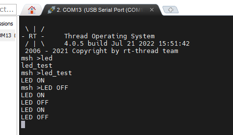
    
    进一步的也可以使用rt_pin_read()结合开发板上的按键读取按键引脚的键值，控制LED的亮灭

  - I2C

    首先进入设置在硬件中开启I2C再在组建中勾选I2C设备驱动

    

    

    设置完成后下载到板子上通过list_device指令查看系统设备情况，检查I2C设备是否已启动

    

    (HPM6750板子似乎I2C接入遇到一些问题等待老师解决)
    
    经过老师的适配，通过将更新包中的以下文件复制到自己工程完成移植

​		

​		移植完成后将AHT10软件包的README文件中初始化程序复制到主函数

​		上机后先检查list_device设备是否加载成功

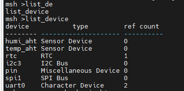

​		通过sensor probe载入i2c设备地址，在通过sensor read读取数据

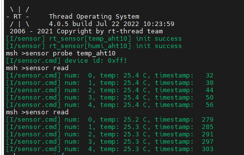

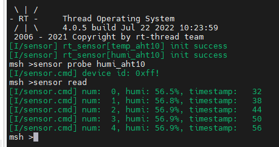

​		最后还可以通过sensor info查询传感器信息

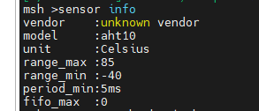

- ##### HPM6750

  HPM6750的每个GPIO接口有：

  DI 状态寄存器 

  

  DO 输出寄存器

  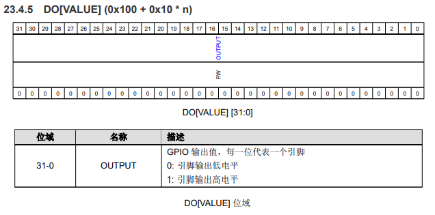

  OE 方向控制寄存器 

  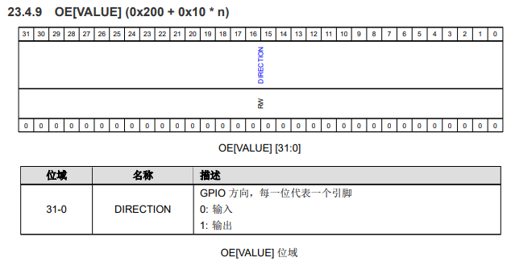

  IF 中断标志

  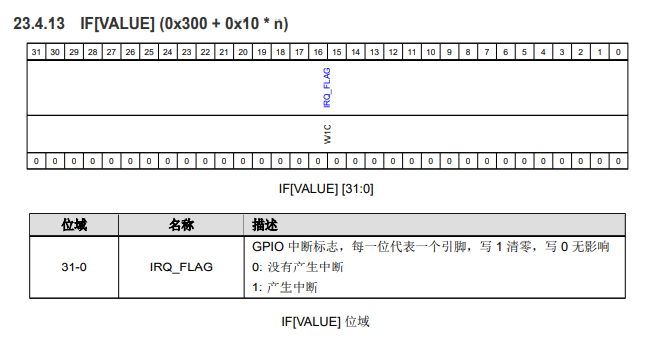

  IE 中断使能

  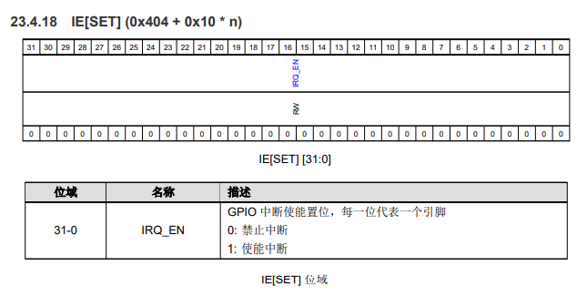

  PL中断极性 

  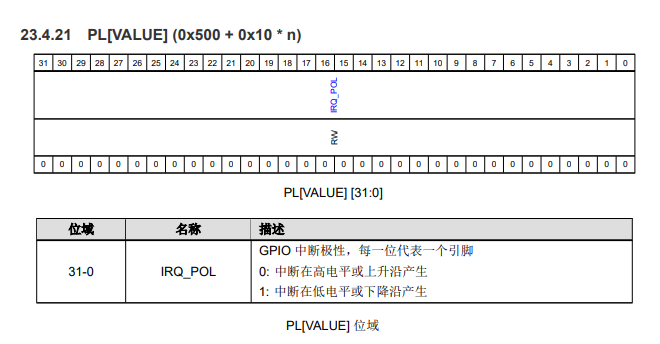

  TP中断类型

  

  AS 异步中断

  

  