# RT-Thread夏令营Day2 多线程 定时器

### 多线程

RT-Thread采用抢占式调度与时间片调度组合模式，高优先级可以打断低优先级，相同优先级采用时间片调度，中断具有最高优先级。

>   调度为软件实现，中断为硬件实现，所以具有最高优先级。

时间片调度时，占用时间可以配置。

### 线程状态

调度器是最高就绪状态的线程

>   调度器可以随时介入系统进行调度


>   startup启动
>
>   rt_thread_suspend()，挂起函数，**谨慎使用**，使用有门槛
>
>   rt_thread开头函数可以在thread.c文件中找到
>
>   IPC：进程间通信

### 特殊线程

##### 空闲线程 

优先级：MAX

空闲线程优先级最低，永远为**就绪态**，永远不能被挂起

空闲线程会回收被删除的线程的资源

>   空闲线程是最忙的，只回收**线程资源**

##### 主线程

优先级：10

系统启动时创建，入口函数：main_thread_entry()，可以添加用户代码

##### finish

优先级：20

串口可以输入，调命令等

### RTOS调度器对比

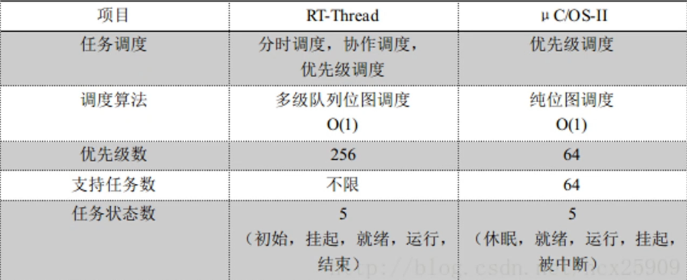

>   O(1):运行一次就一定会获得结果

### 调度算法

抢占式:bitmap算法

时间片:round-robin算法

>   算法在rtstudio.c里

### 动态静态线程创建区别

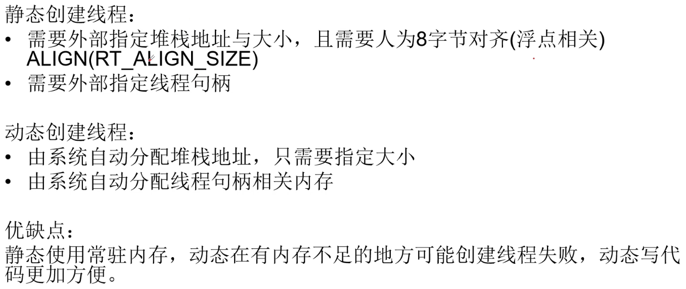

>   句柄:可以寻找到所创建目标的地址
>
>   常驻内存:不归rtt内存管理机制管理,代码编译时就开辟内存
>
>   >   **Keil编译后的Code，RO，RW，ZI**
>   >
>   >   Code：代码占用的空间
>   >
>   >   RO：(Read Only)只读常量的大小（程序已经定义的常量），如const型。
>   >
>   >   RW：(Read Write) 是可读可写变量，初始化时候就已经赋值了的数据
>   >
>   >   ZI：程序中用到的变量并且被系统初始化为0的变量的字节数（未初始化的全局变量）
>   >
>   >   BSS：通常是指用来存放程序中未初始化的或者初始化为0的全局变量和静态变量的一块内存区域。特点是可读写的，在程序执行之前*BSS段*会自动清0。
>   >
>   >   在烧写时，FLASH中的被占用的空间为：Code + RO Data + RW Data
>   >
>   >   初始化时，RW-data从flash拷贝到RAM
>   >
>   >   程序运行时，芯片内部RAM使用的空间为： RW Data + ZI Data
>   >
>   >   >   BSS,ZI不保存在flash

### 静态线程创建

```c
rt_err_t rt_thread_init(struct rt_thread *thread,			//线程句柄,线程指针
                        const char       *name,				//线程名字
                        void (*entry)(void *parameter),		//线程对应函数地址
                        void             *parameter,		//函数参数
                        void             *stack_start,		//栈起始地址
                        rt_uint32_t       stack_size,		//栈大小
                        rt_uint8_t        priority,			//抢占优先级
                        rt_uint32_t       tick);			//时间片所需tick
```

>   需要人为8字节对齐:一个存储单元为8字节
>
>   RT_NAME_MAX管理名字长度,一般**不超过8**

### 动态线程创建

```c
rt_thread_t rt_thread_create(const char *name,					//线程名字
                             void (*entry)(void *parameter),	//线程对应函数地址
                             void       *parameter,				//函数参数
                             rt_uint32_t stack_size,			//栈大小
                             rt_uint8_t  priority,				//抢占优先级
                             rt_uint32_t tick);					//时间片所需tick
```

>   无句柄,栈起始地址,会自动返回一个句柄
>
>   RT_NAME_MAX管理名字长度,一般**不超过8**

### 启动线程

```c
rt_err_t rt_thread_startup(rt_thread_t thread);		//形参:句柄
```

>   rt_thread_t	_t结尾的基本都是指针

### 线程睡眠

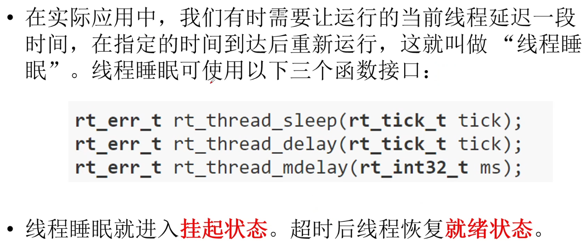

>   不同cpu tick对应时间不同

### 线程退出

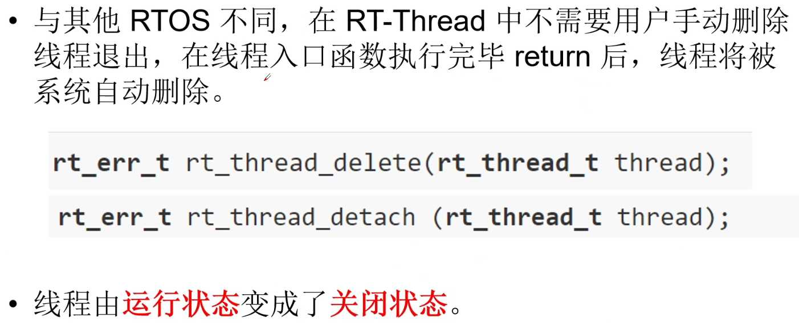

>   自动删除,rtt空闲线程自动处理
>
>   也可以手动,**不建议**

### 错误码

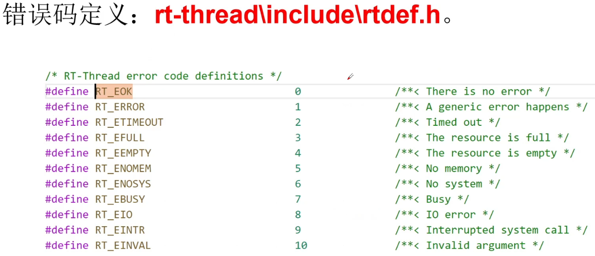

>   错误码前加'-'
>
>   eg:-RT_EOK

### 线程实验

```c
/*static*/
ALIGN(8)							//8字节对齐
struct rt_thread static_thread;		//的指针为句柄
rt_uint8_t static_stack[2048];		//栈空间

void thread_static(void)
{
    while(1)
    {
        rt_kprintf("1");
        rt_thread_delay(100);
    }
}
void thread_dynamic(void)
{
    while(1)
    {
        rt_kprintf("2");
        rt_thread_delay(100);
    }
}
void thread_test(void)
{
    /* init thread */
    rt_thread_init(&static_thread, "static", thread_static, RT_NULL, &static_stack[0], 2048, 16, 100);

    /* startup thread */
    rt_thread_startup(&static_thread);

    
    
    rt_thread_t dynamic_thread = RT_NULL;

    /* creat thread */
    dynamic_thread = rt_thread_create("dynamic", thread_dynamic, RT_NULL, 2048, 16, 500);

    rt_thread_startup(dynamic_thread);
}
MSH_CMD_EXPORT(thread_test,  static thread / dynaimic thread test sample);
```

### 其他线程相关API

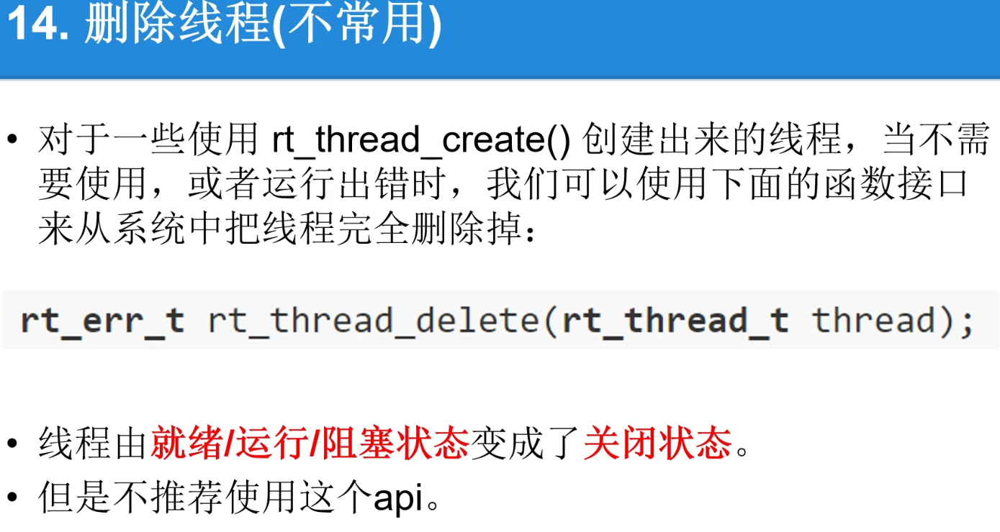

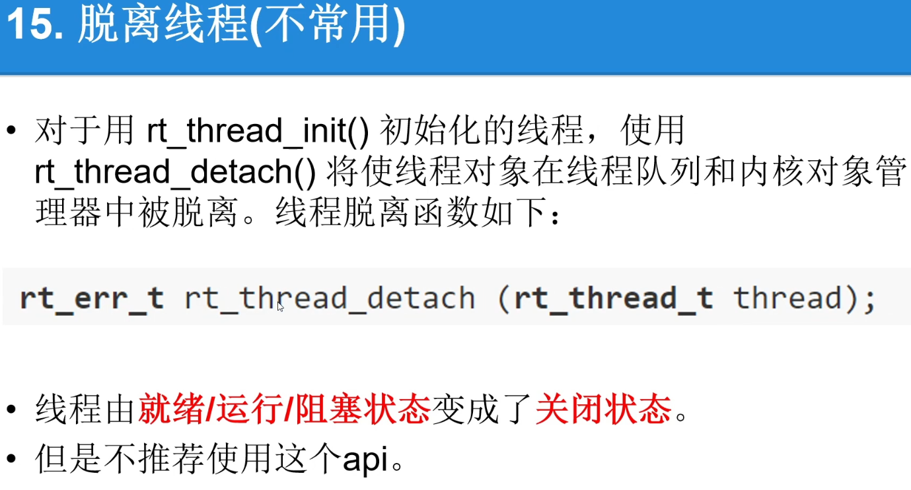

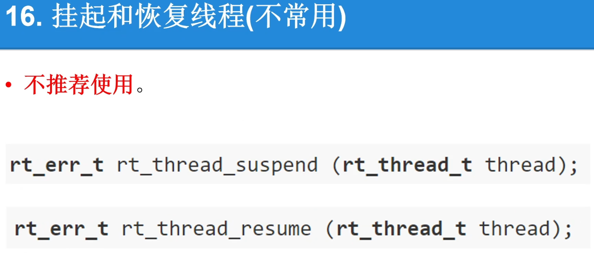

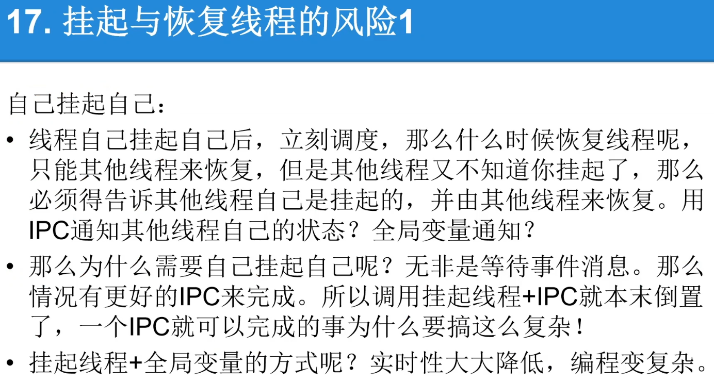

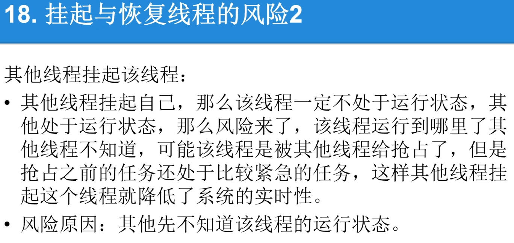

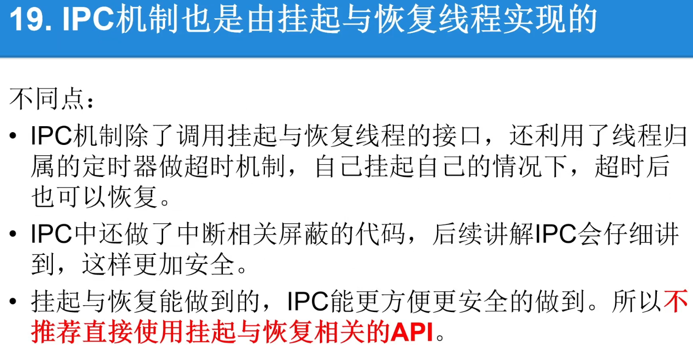

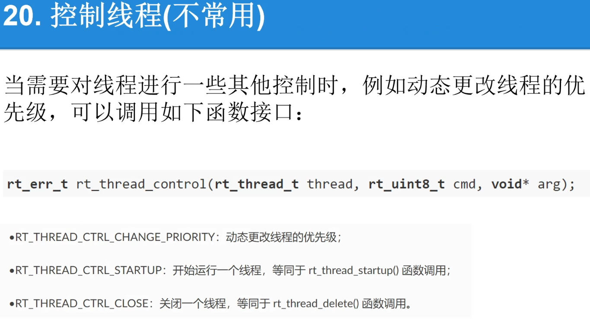

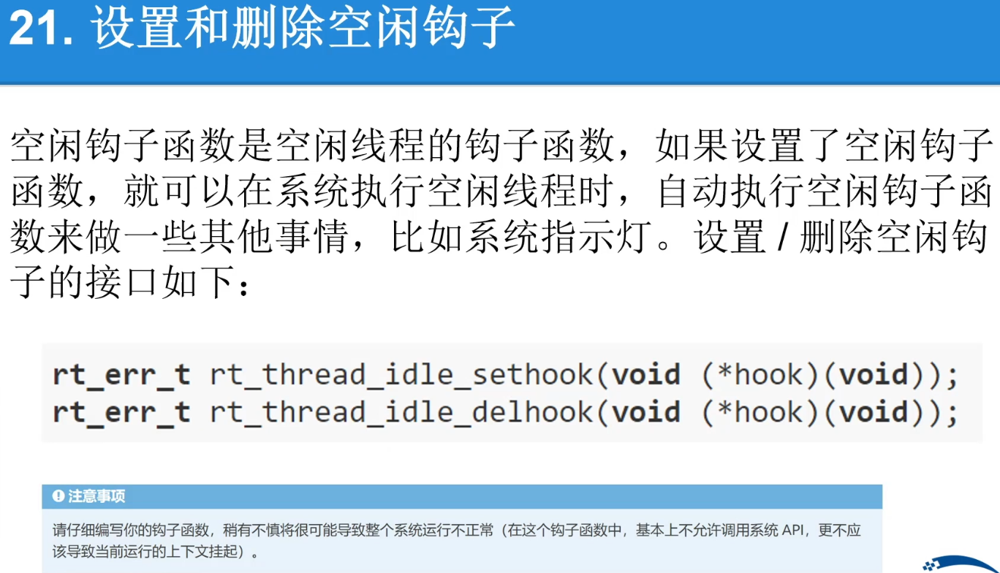

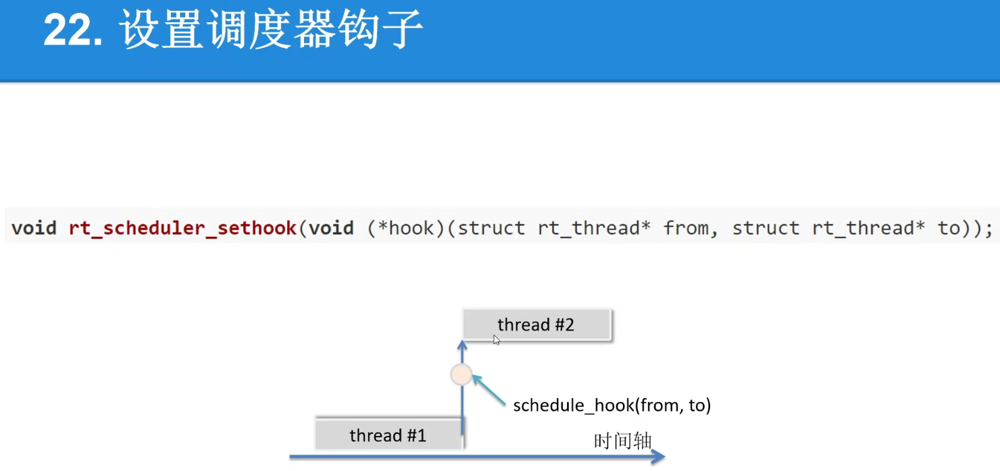

### 三个特殊线程

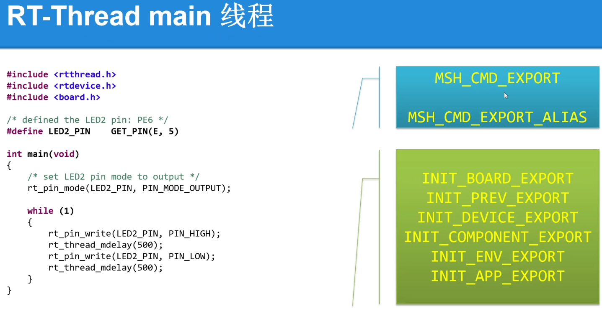

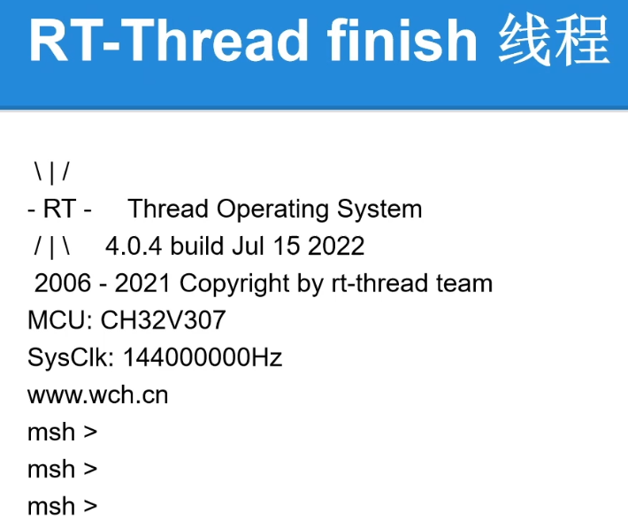


### 内核代码

#### CTRL+H	搜索

文件:全部

c/c++:已经编译的

#### MSH_CMD_EXPORT指令

​	version：版本

​	list：查看线程

#### main线程


根据工具链不同会指定不同的汇编文件跳转


MDK启动流程

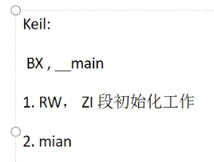

GCC启动文件位置

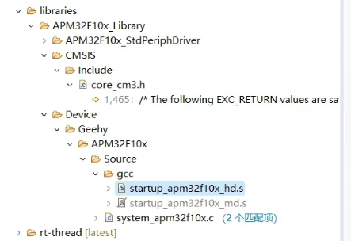

点击复位跳转代码


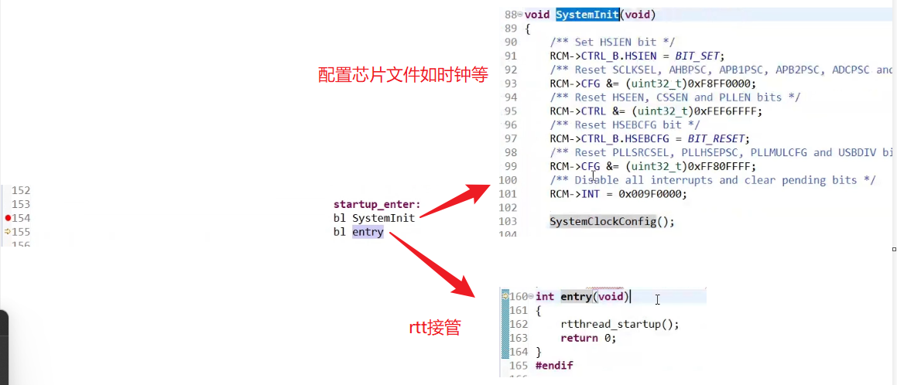

rtthread_startup()

​	关闭中断

​	板子初始化

​		eg初始化时钟......

​	......时钟,调度器初始化......

#### finsh线程

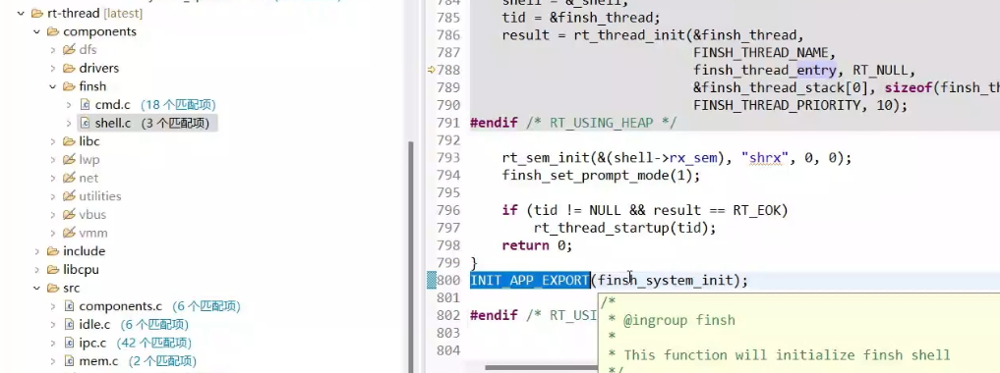

#### idle线程

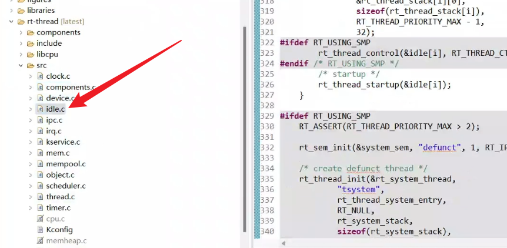

### 课后

深入理解三个线程运行流程

### 定时器

#### 定时器分类

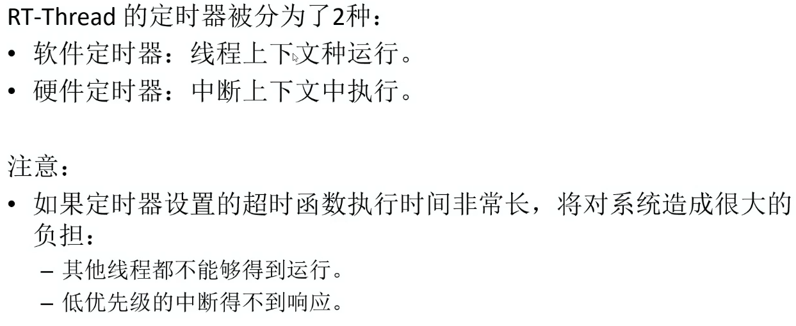

>   不做过多用途,仅作通知用

#### 创建/初始化定时器

```c
//静态接口
void rt_timer_init(rt_timer_t  timer,					//timer句柄
                   const char *name,					//timer名字
                   void (*timeout)(void *parameter),	//timer函数
                   void       *parameter,				//timer入参
                   rt_tick_t   time,					//timer时间(tick)
                   rt_uint8_t  flag);					//定时模式:单次/周期
```

```c
//动态接口
rt_timer_t rt_timer_create(const char *name,
                           void (*timeout)(void *parameter),
                           void       *parameter,
                           rt_tick_t   time,
                           rt_uint8_t  flag);
//返回timer句柄
```

#### 定时器参数


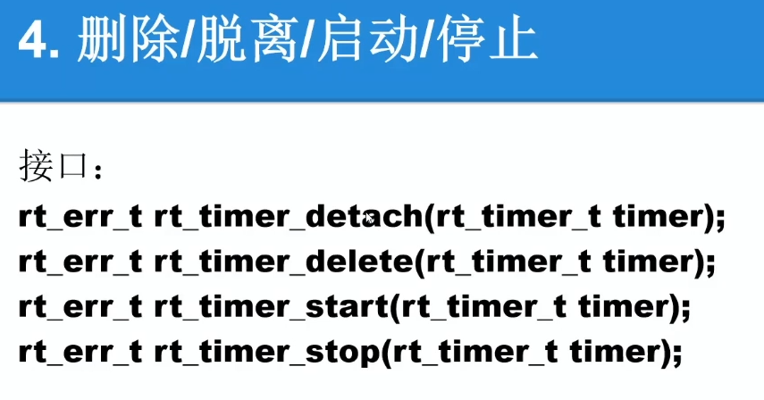

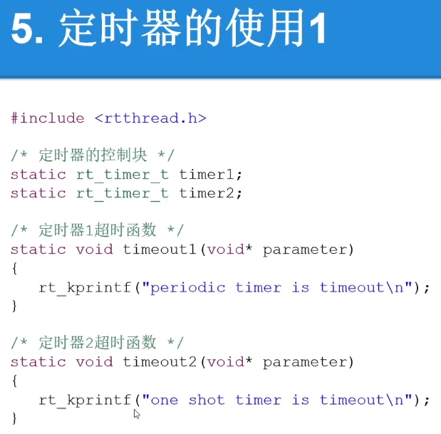

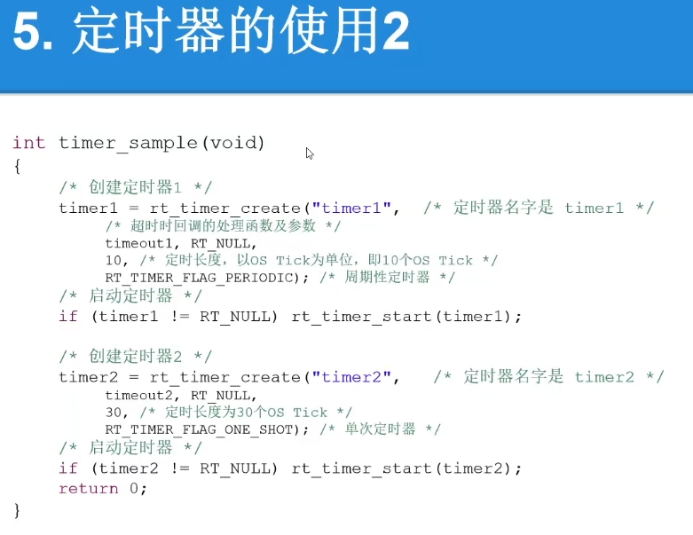

### 例程参考

[kernel-sample](https://github.com/xiangxistu/kernel-sample)

### 打开调试

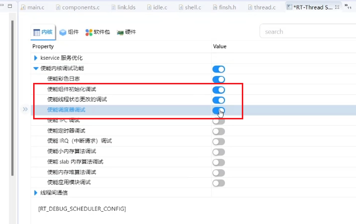

### 作业