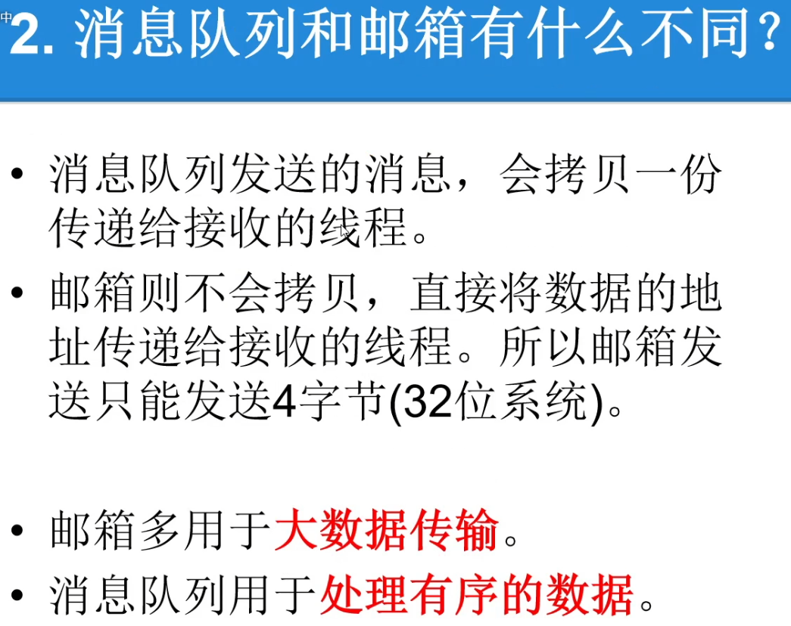
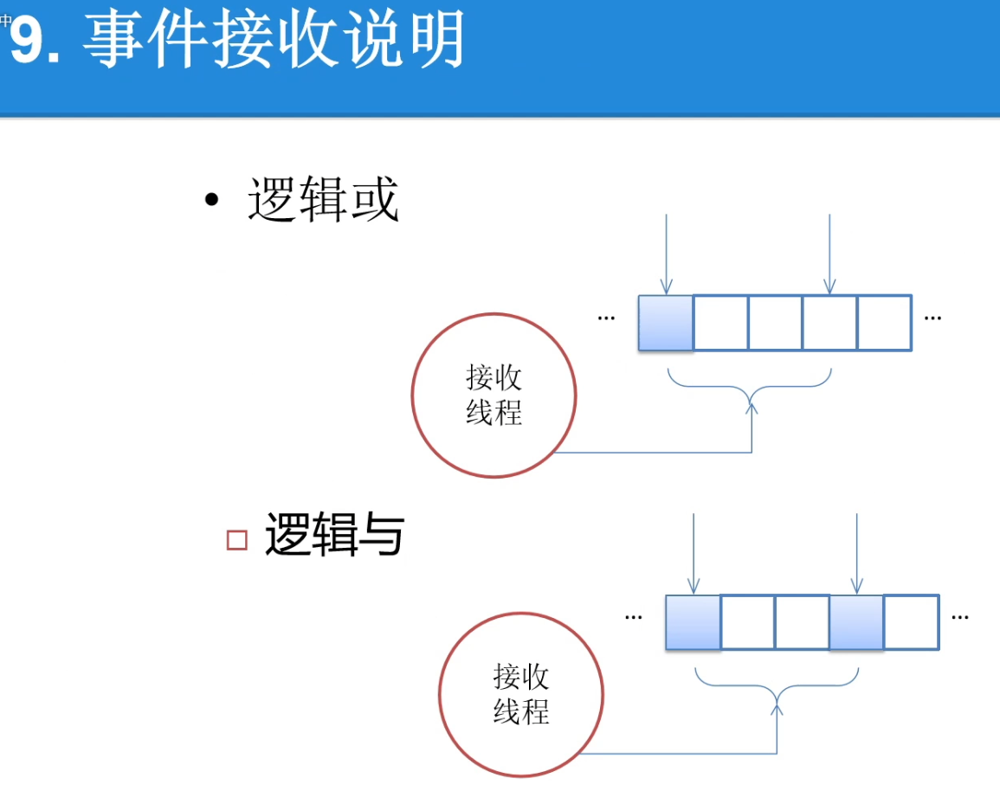
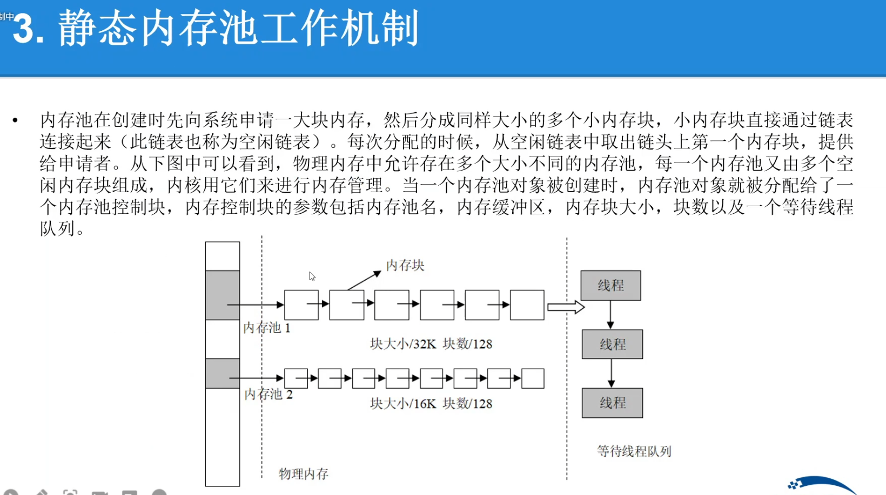
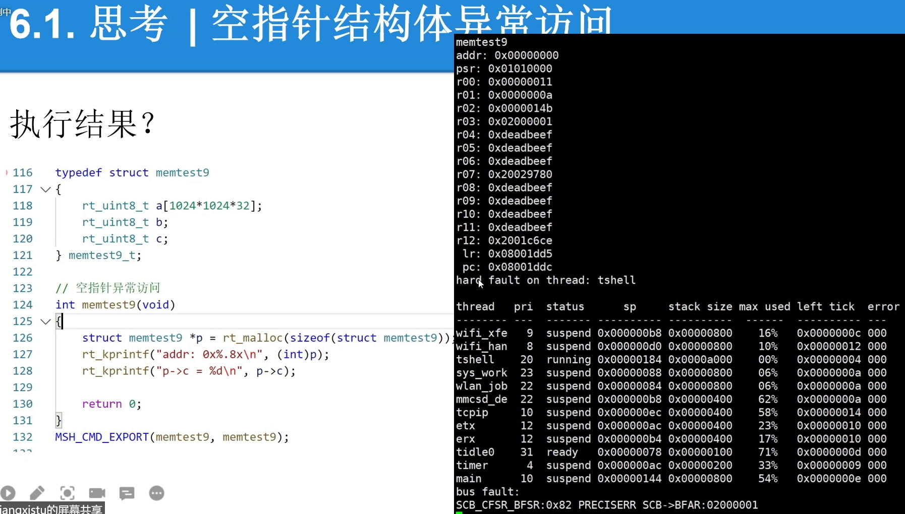

# RT-Thread夏令营Day3 IPC进程间通信 内存管理


### 信号量（sem）


```c
//动态创建 
rt_sem_t rt_sem_create(const char *name,	//信号量名称
                        rt_uint32_t value,	//信号量初始值
                        rt_uint8_t flag);	//信号量标志,如下
```


```c
//静态创建
rt_err_t rt_sem_init(rt_sem_t       sem,	//信号量对象的句柄
                    const char     *name,
                    rt_uint32_t    value,
                    rt_uint8_t     flag)
```

#### 获取信号量

```c
//1
rt_err_t rt_sem_take (rt_sem_t sem, 	//信号量对象的句柄
                      rt_int32_t time);	//指定的等待时间，单位是操作系统时钟节拍（OSTick）
//2
rt_err_t rt_sem_trytake(rt_sem_t sem);	//无等待获取
```


#### 释放信号量

```c
rt_err_t rt_sem_release(rt_sem_t sem);
```


```c
static struct rt_current_priority_semaphore *test_sem = RT_NULL;

void semaphore_test(void)
{
    /* release */
    rt_sem_release(test_sem);
}
MSH_CMD_EXPORT(semaphore_test,  semaphore_test);

void semaphore_dynamic(void)
{
    test_sem = rt_sem_create("test_sem", 0, RT_IPC_FLAG_FIFO);
    while(1)
    {
        rt_sem_take(test_sem, RT_WAITING_FOREVER);
        rt_kprintf("tack semaphore.\n");
    }
    rt_semdelete(test_sem);
}
void semaphore_thread_test(void)
{
    rt_thread_t dynamic_thread = RT_NULL;

    /* creat thread */
    dynamic_thread = rt_thread_create("semaphore", semaphore_dynamic, RT_NULL, 2048, 16, 500);

    rt_thread_startup(dynamic_thread);
}
INIT_APP_EXPORT(semaphore_thread_test);
```


信号量为5，每次执行，信号量-1直至为0.


### 互斥锁（mutex）


### 邮箱（mailbox）


<font color="red">不拷贝数据，拷贝地址</font> 

<font color="red">比全局变量实时性高</font> 


#### 创建/初始化邮箱

```c
//动态创建
rt_mailbox_t rt_mb_create (const char* name, 	//邮箱名称
                           rt_size_t size, 		//邮箱容量
                           rt_uint8_t flag);	//邮箱标志，它可以取如下数值： RT_IPC_FLAG_FIFO 或 RT_IPC_FLAG_PRIO

//RT_IPC_FLAG_FIFO 属于非实时调度方式，除非应用程序非常在意先来后到，并且你清楚地明白所有涉及到该邮箱的线程都将会变为非实时线程，方可使用 RT_IPC_FLAG_FIFO，否则建议采用 RT_IPC_FLAG_PRIO，即确保线程的实时性。


//静态创建
rt_err_t rt_mb_init(rt_mailbox_t mb,	//邮箱对象的句柄
                    const char* name,	//邮箱名称
                    void* msgpool,		//缓冲区指针 
                    rt_size_t size,		//邮箱容量
                    rt_uint8_t flag);	//邮箱标志，它可以取如下数值： RT_IPC_FLAG_FIFO 或 RT_IPC_FLAG_PRIO
```


 


### 消息队列（messagequeue）





```c
//动态创建
rt_mq_t rt_mq_create(const char* name, 		//消息队列的名称
                     rt_size_t msg_size,	//消息队列中一条消息的最大长度，单位字节
            		 rt_size_t max_msgs, 	//消息队列的最大个数
                     rt_uint8_t flag);		//消息队列采用的等待方式，它可以取如下数值： RT_IPC_FLAG_FIFO 或 RT_IPC_FLAG_PRIO

//静态创建
rt_err_t rt_mq_init(rt_mq_t mq, 			//消息队列对象的句柄
                    const char* name,		//消息队列的名称
                    void *msgpool, 			//指向存放消息的缓冲区的指针
                    rt_size_t msg_size,		//消息队列中一条消息的最大长度，单位字节
                    rt_size_t pool_size, 	//存放消息的缓冲区大小
                    rt_uint8_t flag);		//消息队列采用的等待方式，它可以取如下数值： RT_IPC_FLAG_FIFO 或 RT_IPC_FLAG_PRIO
```


### 事件组（event）





### 内存管理


 


关闭之后，无法使用动态创建方式，只可使用静态创建。


使用需要打开libc


### 内存池





 





### IPC讲解


强制挂起线程危险原因，挂起后无操作，应配合复位使用

