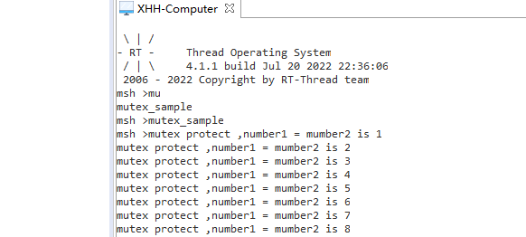
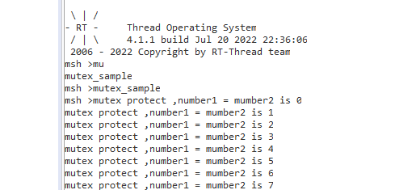

# xuhonghao 第三天总结

## 一、发现的问题
今天和同学们一起讨论发现了一个优先级翻转的例子刚好看见了
文件官方互斥量例子当中线程1、2的优先级为8，大于主线程和shell线程
发生了优先级翻转的问题代码如下


```
#include <rtthread.h>

#define THREAD_PRIORITY         8
#define THREAD_TIMESLICE        5

/* mutex handler */
static rt_mutex_t dynamic_mutex = RT_NULL;
static rt_uint8_t number1, number2 = 0;

ALIGN(RT_ALIGN_SIZE)
static char thread1_stack[1024];
static struct rt_thread thread1;
static void rt_thread_entry1(void *parameter)
{
    while (1)
    {
        /* pending the mutex */
        rt_mutex_take(dynamic_mutex, RT_WAITING_FOREVER);

        /* protect and deal with public variables */
        number1++;
        rt_thread_mdelay(10);
        number2++;

        /* release the mutex */
        rt_mutex_release(dynamic_mutex);
    }
}

ALIGN(RT_ALIGN_SIZE)
static char thread2_stack[1024];
static struct rt_thread thread2;
static void rt_thread_entry2(void *parameter)
{
    while (1)
    {
        rt_mutex_take(dynamic_mutex, RT_WAITING_FOREVER);
        if (number1 != number2)
        {
            rt_kprintf("not protect.number1 = %d, mumber2 = %d \n", number1, number2);
        }
        else
        {
            rt_kprintf("mutex protect ,number1 = mumber2 is %d\n", number1);
        }

        number1++;
        number2++;
        rt_mutex_release(dynamic_mutex);

        if (number1 >= 50)
            return;
    }
}

int mutex_sample(void)
{
    /* create mutex */
    dynamic_mutex = rt_mutex_create("dmutex", RT_IPC_FLAG_PRIO);
    if (dynamic_mutex == RT_NULL)
    {
        rt_kprintf("create dynamic mutex failed.\n");
        return -1;
    }

    rt_thread_init(&thread1,
                   "thread1",
                   rt_thread_entry1,
                   RT_NULL,
                   &thread1_stack[0],
                   sizeof(thread1_stack),
                   THREAD_PRIORITY, THREAD_TIMESLICE);
#ifdef RT_USING_SMP
    /* Bind threads to the same core to avoid messy log output when multiple cores are enabled */
    rt_thread_control(&thread1, RT_THREAD_CTRL_BIND_CPU, (void*)0);
#endif
    rt_thread_startup(&thread1);

    rt_thread_init(&thread2,
                   "thread2",
                   rt_thread_entry2,
                   RT_NULL,
                   &thread2_stack[0],
                   sizeof(thread2_stack),
                   THREAD_PRIORITY - 1, THREAD_TIMESLICE);
#ifdef RT_USING_SMP
    /* Bind threads to the same core to avoid messy log output when multiple cores are enabled */
    rt_thread_control(&thread2, RT_THREAD_CTRL_BIND_CPU, (void*)0);
#endif
    rt_thread_startup(&thread2);
    return 0;
}

/* export the msh command */
MSH_CMD_EXPORT(mutex_sample, mutex sample);
```


以上代码线程2的优先级高于线程1，而当设置线程1优先级为8时，线程1、2的优先级都大于shell线程，运行结果由1开始打印





但是按照逻辑来说，线程2的优先级跟高，应该先被执行，却被线程1（此时相当于中间优先级）抢断，发生优先级翻转
因此，我将线程1的优先级改为23，运行结果如下





解决了优先级翻转的问题，但是对为什么会产生优先级翻转还不是特别深入理解。


## 二、ipc包括：信号量、互斥量、事件、邮箱、消息队列

    1）信号量：
        主要用于线程与线程之间的同步、线程与中断之间的同步、资源计数、
        注意：不能用于组合事件、中断中不获取信号量


    2）互斥量也称二值信号量：
        可以控制优先级翻转问题，具有优先级继承机制，可以嵌套

    
    3）邮箱：
        比全局变量实时性高，采用FIFO，一般返回数据结构体的指针，其中数据结构其中包括数据指针和数据长度。一般用于大量数据。
        发送邮箱满时：发送挂起
        接收为空时：接收挂起
        注意：邮箱只发送4字节数据（一个地址）、不拷贝数据、


    4）队列：
        和邮箱不同的是，拷贝数据，一般用于有序数据。


    5）事件：
        仅用于同步，可以选择事件之间相与、相或、一对多的同步，使用于任务与任务之间，任务与ISR之间，每个线程有32个事件标志。


## 三、个人感觉ipc的调度关系都类似所以我就调一个吧

使用rt_sem_create（）创建信号量其中包括一些参数检测，初始化信号量值
使用rt_sem_take（）获取信号量
主要是rt_sem_release（）释放信号量函数中会开启调度器rt_schedule();，实现线程切换
